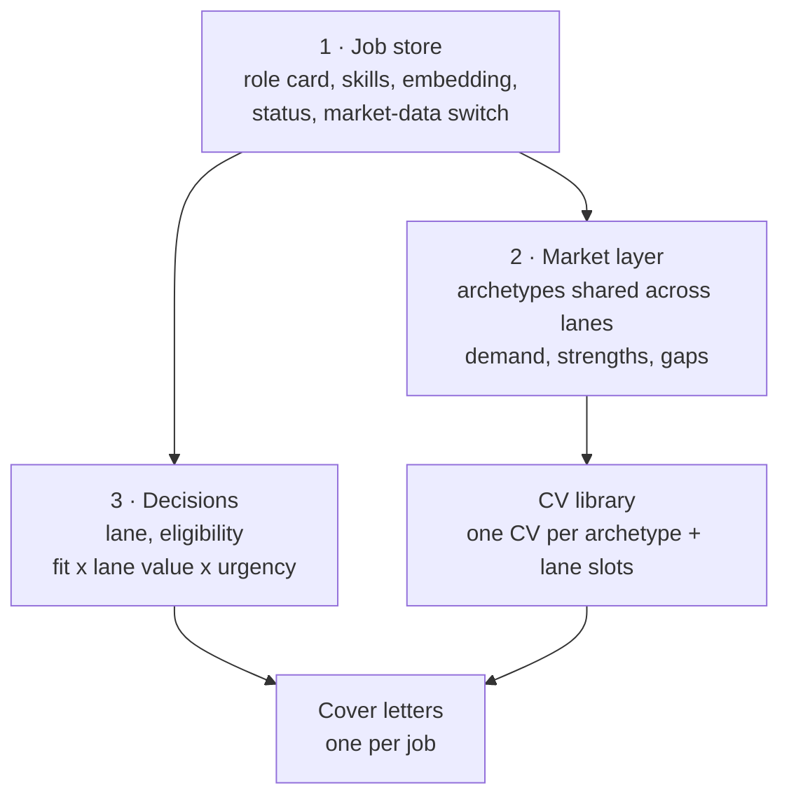
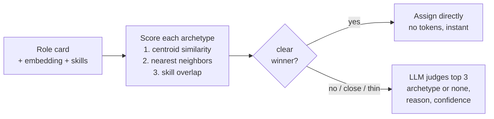
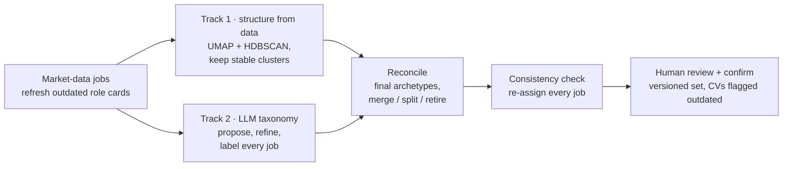

# job-radar

An agentic job-search assistant for the Swiss data-science and AI market: it ingests job postings, screens and scores each one against a candidate profile with a LangGraph pipeline, learns the *kinds of work* in the market (archetypes) from embeddings and an LLM taxonomy, ranks jobs by fit, lane and deadline, and drafts CVs and cover letters with an LLM critic, deterministic guardrails and PDF export.

Built and used daily as a real tool, not a demo. The repo ships with a **fictional example profile** (`examples/`), so it runs end to end without anyone's personal data.

## What it does

- **Ingest:** Adzuna, SerpApi (Google Jobs) and JSearch clients, plus manual entry by URL with auto-fetch and LLM extraction. Dedupe by URL hash.
- **Screen:** a 5-node LangGraph pipeline per job: normalize → card blurb → filter gate → score match → extract gaps, judged against the project database and coursework. A cheap model for filtering, a stronger model for match and gaps, a short-circuit to save tokens on excluded jobs.
- **Structure the market:** a role card per job (English summary, canonical skills, timeline signals), local embeddings, and archetypes learned from postings you mark as market data. New jobs are assigned by embeddings first, the LLM only when unsure.
- **Triage:** FastAPI + HTMX dashboard. A review queue (unreviewed first), priority ranking, sorting and filters, add-a-job-by-URL, archive/shortlist.
- **Draft CVs:** a second LangGraph with a real cycle, `draft_cv ⇄ critique_cv`, up to 3 rounds. The drafter selects and phrases entries from a tagged project database per job; the critic fact-checks every claim against the sources and scores relevance, honesty, impact, clarity and keyword fit.
- **Export:** edit the CV by hand (saved as a new version), then render it to a styled A4 PDF.

## Archetypes

There is no hand-written list of job categories. Archetypes (kinds of work, e.g. "LLM & agentic AI application engineering") are learned from the postings you mark as market data, versioned, and reworked on demand from the **Classify** page. They drive the market analysis, the CV library and the search keywords for API ingestion.

## Engineering highlights

- **Structured outputs everywhere.** Every LLM call returns a Pydantic schema; no free-text parsing.
- **Deterministic guardrails around LLM judgments.** The CV critic can't approve a draft whose own honesty/relevance scores are low. It can't lower honesty without quoting a fabrication that literally exists in the draft (it used to "find" tools that only appeared in the job posting). Skill groups (3-5), summary length and course grades are checked in code, not left to the prompt.
- **Grounding by construction.** The drafter may only cite tools listed in a selected project's `Tools:` field; static facts (names, dates, contact details) come from a template and are copied verbatim.
- **Evals.** `evals/run_eval.py` re-screens every labeled job and reports match-level agreement; archetype reworks run a leave-one-out consistency check and report cluster stability and track agreement.
- **Observability.** Every node logs model, tokens and latency.
- **Provider switch.** `LLM_PROVIDER=anthropic|ollama` swaps screening between Claude and a local model. The CV loop always runs on Claude (Sonnet drafts, Opus critiques), because a local 8B model fabricated details while its own critique approved them.
- **Cost-aware.** Screening a job takes ~8s and ~11k tokens on Claude. Bulk-ingested jobs that fail a hard filter stop before the expensive steps; hand-added jobs get a warning instead and are screened fully.

## Setup

```bash
python3.13 -m venv .venv
source .venv/bin/activate
pip install -r requirements.txt
cp .env.example .env               # add ANTHROPIC_API_KEY (ingestion keys optional)
python scripts/sync_profile.py     # copies the example profile into place and seeds the DB
uvicorn app.main:app --reload --port 8000   # dashboard at localhost:8000
```

PDF export needs Google Chrome installed (it prints with headless Chrome).

### Using your own profile

Your data never goes into git. Create a private folder with the same layout as `examples/` (profile files, labeled seed jobs, CV template), set `PROFILE_SOURCE_DIR` to it in `.env`, and re-run `python scripts/sync_profile.py`. The working copies (`profile/`, `cv_profile/`, `data/`, `evals/results/`) are gitignored. See [`examples/README.md`](examples/README.md).

| File | Used for |
|---|---|
| `profile/filters.md`, `constraints.md` | Exclude/flag rules, timeline and language constraints (screening) |
| `profile/lanes.md` | Application lanes: detection, eligibility, value, CV sentence, practical facts for cover letters |
| `profile/motivation.md` | Why you're looking, in your words (the only source for a cover letter's motivation) |
| `profile/projects.md` | Project database: each piece of work tagged with `Type`, `Source`, explicit `Tools`, methodology and results (CV drafting) |
| `profile/coursework.md` | Courses by degree (CV drafting, cited only to fill gaps; grades are stripped automatically) |
| `cv_profile/cv_template.md` | Static CV facts: contact details, degrees, employers and dates, baseline skills, languages, awards |
| `cv_profile/photo.jpg` | Optional photo for the PDF |

## Usage

**Daily ingest + screening:**
```bash
python scripts/ingest.py           # fetch new postings from all configured sources
python -m src.screening.run --all   # screen every job without a screening yet
```

**Add a job by hand:** paste the URL into **Add a job** on the board and click **Add & screen**. If the site blocks fetching, a box appears to paste the description. CLI equivalent:
```bash
python scripts/add_manual_job.py "<url>"                                  # tries to auto-fetch the posting
python scripts/add_manual_job.py "<url>" --description "<pasted text>"    # if the site blocks fetching
python -m src.screening.run --all
```

**Role cards and market data** (pipeline revamp, Phase 1): every job gets a role card, a normalized English summary with canonical skills and an embedding, used for archetypes and market stats. Jobs added from the board get one automatically; for everything else:
```bash
python scripts/enrich_jobs.py --missing       # role cards + skills + embeddings for jobs that lack them
```
Mark postings worth learning from as **market data** (◇ on each card, or **Select jobs** for bulk), independent of whether you apply. New skill names land as *pending* on the **Skills** page: approve them, or merge duplicates so they become aliases.

**Archetypes** (Phase 2): the **Classify** page runs a rework over your market-data jobs (stable clustering + an LLM taxonomy, reconciled by Opus), shows the draft with quality signals and a map, and lets you rename, merge, split or move jobs before confirming it as a new versioned set. New jobs are matched to the active set automatically. CLI: `python scripts/archetypes.py status|rework|assign`.

**Market** (Phase 3): per archetype, which skills its market-data jobs ask for, your profile coverage, strengths (with the projects/courses that prove them) and gaps, plus LLM next-step suggestions and a to-do list.

**CV library** (Phase 4): one CV per archetype, generated from its market brief and reused for every job in it. The library flags a CV as outdated when new market-data jobs arrive or your profile changes; a job's PDF adds a one-line lane sentence (e.g. part-time availability). You can still tailor a CV to a single job.

**Lanes, ranking and cover letters** (Phase 5): `profile/lanes.md` defines your application lanes (e.g. working student, thesis internship, summer internship, full-time). Each job gets a lane, an eligibility check and a lane-value score; the board ranks by priority = fit × lane value × urgency (deadline). On a job's page, **Write cover letter** drafts an English letter grounded in the job's CV and your projects, critiqued for honesty, relevance, specificity and tone; edit it and download a one-page PDF. Backfill: `python scripts/assess_lanes.py --missing`.

**Review and correct:** on a job's page, **Archive** or **Shortlist**, set its archetype or lane by hand if the automatic one is wrong. A wrong description can be replaced and re-screened from the same page.

**Tailor a CV to one job:** **Prepare CV** on the job page (framed by the job's archetype), or `python -m src.cv.run --job-id <id>` (`--regenerate` revises the latest draft). Drafts land in `cv_drafts/` with the verdict, rubric scores, feedback and unresolved gaps. When a gap is something the candidate really has, add it to the profile source, sync, and regenerate. Always read a generated CV before sending it.

**Edit and export:** **Edit** opens the Markdown (saving creates a new version); **Download PDF** renders the latest version with `src/cv/style.css`, tightening spacing to fit two pages before ever spilling onto a third. CLI: `python scripts/cv_pdf.py cv_drafts/<draft>.md`.

## Repository layout

Each component is a package with its own `prompts/` folder; `load_prompt("screening/score_match")` reads `src/screening/prompts/score_match.md`.

```
src/
  db.py            SQLModel tables
  llm/             call plumbing, model config per role, structured-output schemas
  profile/         profile loaders (projects, coursework, constraints, lanes, motivation) and the CV template
  ingest/          API clients, manual entry, URL fetch      prompts/: job_posting
  enrich/          role cards, skills, embeddings, description breakdown   prompts/: role_card, breakdown
  screening/       5-node LangGraph screening                 prompts/: filter_gate, generate_blurb, extract_title_company, score_match, extract_gaps
  archetypes/      assignment, rework (two tracks), commit    prompts/: adjudicate, label, merge, reconcile, split, taxonomy
  market/          demand, profile evidence, strengths/gaps   prompts/: profile_skill_map, suggestions
  lanes/           lane detection, assessment, priority       prompts/: assess
  cv/              CV draft/critique graph, library, export, PDF + style.css   prompts/: draft, critique
  letters/         cover letter draft/critique                prompts/: draft, critique
app/               FastAPI routes, services, Jinja2 templates, static JS
scripts/           CLI entry points (sync, ingest, enrich, archetypes, lanes, PDFs)
evals/             screening eval against hand-labeled jobs
```

## Architecture

```
ingest: manual (URL auto-fetch) + Adzuna / SerpApi / JSearch (archetype keywords), dedupe by URL hash
  -> enrichment: role card + skills + embedding -> archetype assignment
  -> screening LangGraph: normalize -> blurb -> filter gate -> score match -> extract gaps
  -> lanes: detection + eligibility + value -> priority
  -> SQLite (jobs, role cards, archetypes, screenings, tracking, CVs, letters)
  -> FastAPI + Jinja2 + HTMX + Alpine.js dashboard: board / job detail / classify / market / CV library / skills
  -> on demand, "Prepare CV": CV LangGraph (Sonnet drafts, Opus critiques)
       draft_cv --> critique_cv --(revise, attempts < 3)--> draft_cv
                         |
                  (approve, or 3 attempts)
                         v
       CVDraft version -> manual edit -> styled HTML -> headless Chrome -> A4 PDF
```

## Eval

`python evals/run_eval.py` re-screens every job in the ground-truth table and scores it; `--fast` scores existing screenings. With the example profile this runs on the six fictional seed jobs.

On the author's private set of hand-labeled postings: **80% match-level agreement within one grade** (12/15 jobs with a comparable label; 47% exact).

## Pipeline design

Design in [`docs/pipeline-revamp.md`](docs/pipeline-revamp.md): the pipeline learns *archetypes* (kinds of work) from postings marked as market data, and reuses one CV per archetype.

**Four layers instead of one per-job chain**



**Assigning a new job to an existing archetype: embeddings first, LLM only when unsure**



**Reworking the archetypes (manual, on demand): two independent tracks, reconciled, then human review**



## Build log

[`plan.md`](plan.md) records the phases, design decisions and the bugs found along the way.
